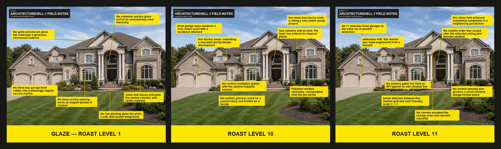

# ArchitectureHell

[](https://github.com/petehottelet/architecturehell/actions/workflows/ci.yml)
[](LICENSE)

ArchitectureHell turns photographs of human-built environments into precisely annotated architectural commentary: sincere praise at **Roast Level 1 (Glaze)**, sharp profession-literate critique at **Roast Level 10**, and architecturally grounded surrealism at **Roast Level 11**.



*The same house, rendered as Glaze, maximum lawful snark, and the non-Euclidean jury dimension.*

The renderer preserves the source photograph and adds feature-specific arrows with flat bright-yellow callout cards. Each card uses black text, no numbering, no border, no shadow, and no rounded corners. Feature bounds keep labels off the architecture they discuss.

## Use

The canonical skill is in [skills/architecturehell](skills/architecturehell). Discovery copies are provided for both Codex and Claude:

- `.agents/skills/architecturehell`
- `.claude/skills/architecturehell`

Both discovery copies are generated from the canonical skill by `tools/sync_skills.py` — never edit them directly. CI fails if they drift; run `python tools/sync_skills.py` after changing anything under `skills/architecturehell/`.

Invoke the skill with an image and a Roast Level from `1` through `11`. Level `1` is always complimentary **Glaze**; level `11` is the intentional non-Euclidean easter egg.

The bundled renderer requires Python and Pillow:

```text
python skills/architecturehell/scripts/annotate_architecture.py \
  --input building.jpg \
  --manifest callouts.json \
  --roast-level 10 \
  --output building-architecturehell.png
```

See [SKILL.md](skills/architecturehell/SKILL.md) for the full workflow and [manifest-schema.md](skills/architecturehell/references/manifest-schema.md) for the callout format.

## Repository scope

Generated annotation output is intentionally ignored. The repository contains the reusable skill, renderer, voice system, critique lenses, and style reference assets.

## Development

The renderer's test suite needs only Python 3.10+ and Pillow:

```text
python -m pip install Pillow
python -m unittest discover -s tests -v
```

CI runs the suite on Linux, macOS, and Windows (Python 3.10 and 3.12), verifies the discovery copies are in sync, and uploads a rendered smoke image from `tools/render_smoke.py` on every run.
